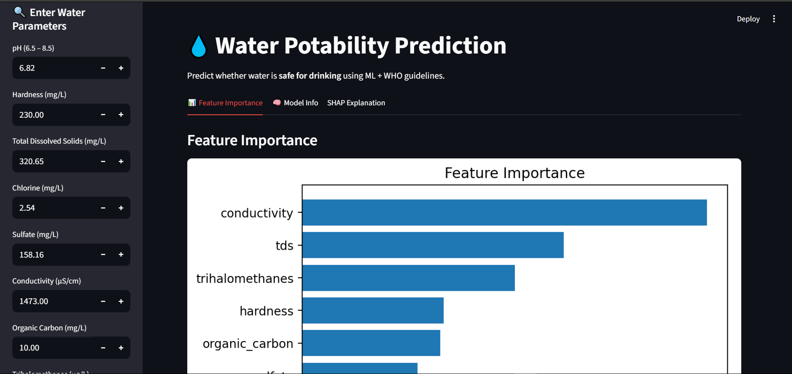
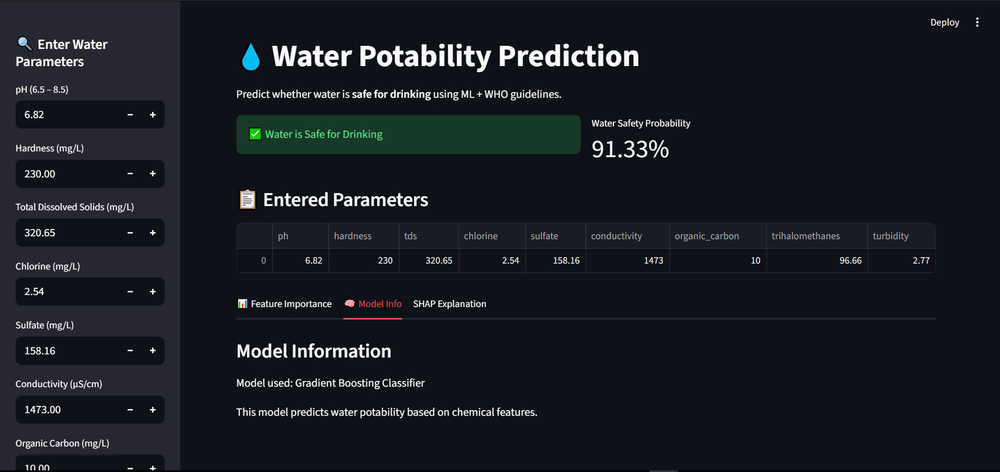
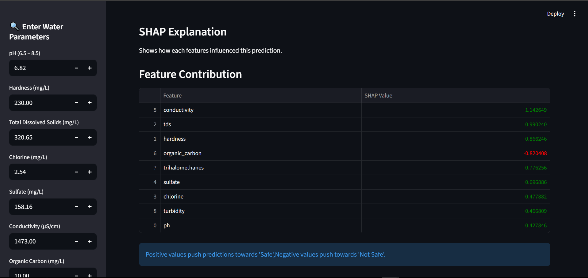

# 🚰 Water Potability Prediction — Machine Learning Project

An end-to-end machine learning project that predicts whether water is safe for drinking using physicochemical properties.  
The primary focus is on **data preprocessing, model development, evaluation, and reproducibility**.

---

## 📸 App Preview

Below are sample outputs from the model interface:

### 🔹 Input Interface


### 🔹 Prediction Result


### 🔹 Model Insight


---

## 📌 Problem Statement

Safe drinking water is critical for public health.  
This project builds a classification model to determine:

- ✅ **1 → Safe for drinking**  
- ❌ **0 → Not safe for drinking**

based on measured water quality parameters.

---

## 🧪 Dataset

The dataset consists of multiple chemical and physical features of water samples:

- pH  
- Hardness  
- Total Dissolved Solids (TDS)  
- Chloramines  
- Sulfate  
- Conductivity  
- Organic Carbon  
- Trihalomethanes  
- Turbidity  

---

## 🔧 Data Preprocessing

- Missing value handling (mean/median imputation)  
- Feature scaling using **StandardScaler**  
- Data consistency checks  
- Feature alignment for model input  

---

## 🧠 Model Development

- **Algorithm:** Gradient Boosting Classifier  
- **Task:** Binary Classification  
- **Framework:** scikit-learn  

### Why Gradient Boosting?
- Captures non-linear relationships  
- Strong performance on tabular data  
- Handles feature interactions effectively  

---

## 📊 Model Evaluation

The model is evaluated using:

- Accuracy  
- Precision  
- Recall  
- F1 Score  

• Test Accuracy: 99%
• Precision: 0.97- (The accuracy of the model when it predicts water is potable).
• Recall: 1.0 -(The model's ability to correctly identify all truly potable water samples).
• F1-Score: 0.98- (The balanced score between Precision and Recall, critical for imbalanced data).

---

## 📂 Project Structure

waterpotabilityy.py   # Inference app
gb_model.pkl          # Trained model
scaler_water.pkl      # Scaler
requirements.txt      # Dependencies
README.md

---

## 📈 Prediction Output

For a given input, the model returns:

- Water safety classification (Safe / Not Safe)  
- Prediction probability (**confidence score**)  

---

## ⚙️ Reproducibility & Environment

### 🐍 Python Version

This project is tested with:

> **Python 3.11**

⚠️ Newer versions may cause compatibility issues.

---

### 📦 Installation

```bash
pip install -r requirements.txt
```

## ▶️ Run the Project (Demo App)

After installing the dependencies, run the following command:

```bash
streamlit run waterpotabilityy.py
```
---

## 🚀 App Features
- Water quality prediction
- Confidence score
- SHAP-based model explanation
- Feature importance visualization